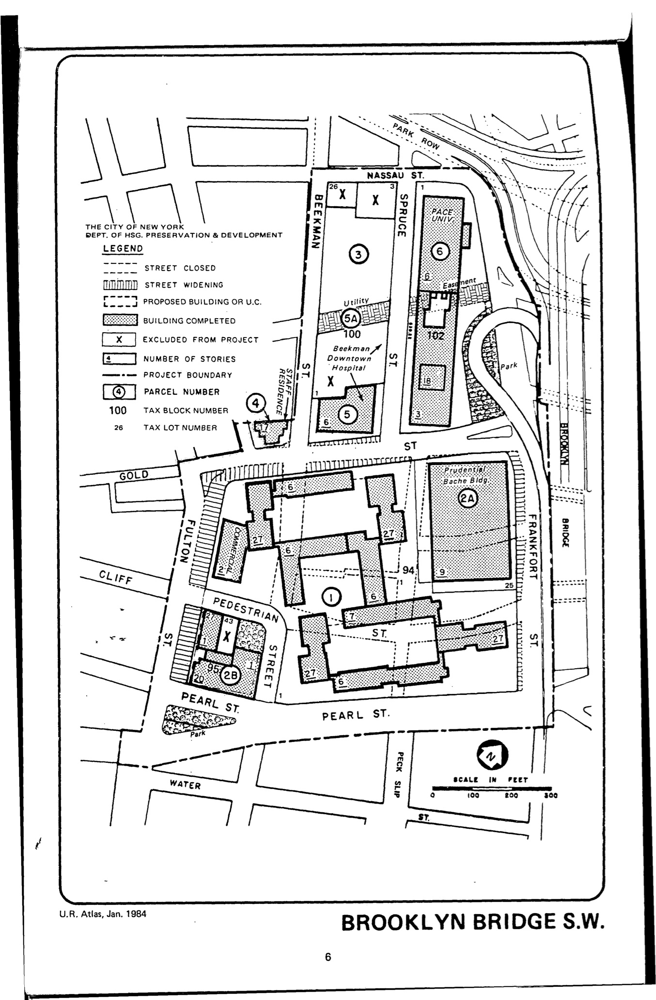

<!---

-->

The Brooklyn Bridge Southwest plan was adopted in 1964, last revised in 1995, and expired in 2004. The plan calls for low-, moderate-, and middle-income housing with appurtenant recreational, community, commercial, and parking facilities; commercial uses limited to offices, retail, data processing, and business establishments; and institutional uses including college, university, hospital, research, and office facilities.

See [References](http://www.urbanreviewer.org/#page=references.html).