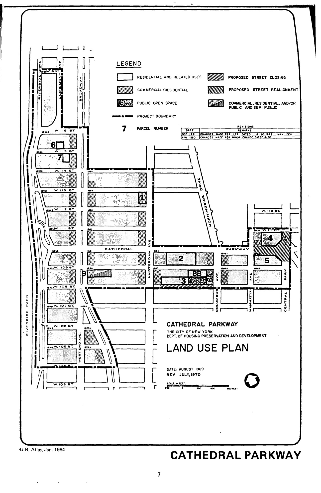

The Cathedral Parkway plan was adopted in 1968, last revised in 2004, and expires in 2008. It designates residential, commercial, public and semi-public, and public open space uses for lots in the plan area.
