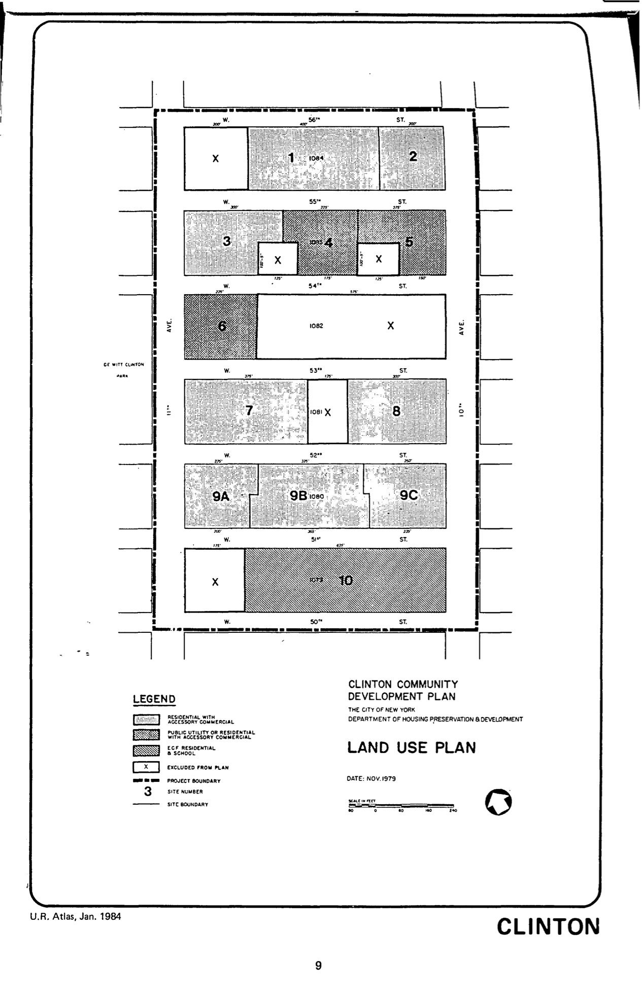

The Clinton plan was adopted in 1969, last revised in 2002, and expired in 2009. It includes residential, community facility, and public utility uses for lots in the plan area.

You can read an incredibly comprehensive history of the area and a tenant that showed what kind of resident-led development is actually possible in New York in Gothamist here: [Urban Removal: How A Utopian Vision For Hell's Kitchen Burned Out](http://gothamist.com/2016/09/20/hells_kitchen_clinton_utopia.php), by Nathan Tempey, Sep. 20, 2016. 

[NYC Housing Preservation and Development, Clinton Urban Third Amended Urban Renewal Area Plan (2002).](https://www.nyc.gov/assets/hpd/downloads/pdfs/services/clinton-third-amended-urp.pdf)
