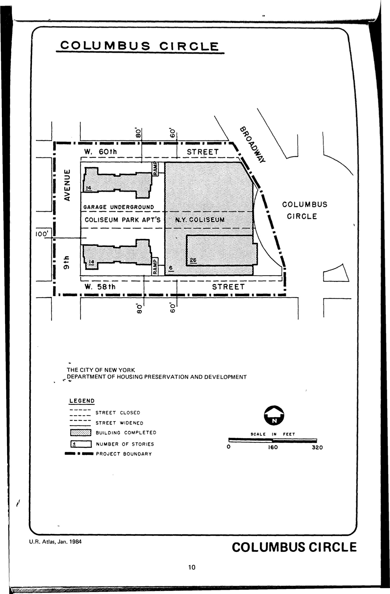

<!----->

The Columbus Circle plan was adopted in 1953, last revised in 1988, and expired in 1993. This single-lot plan includes residential and commercial uses.

[NYC Housing Preservation and Development, Columbus Circle Third Amended Renewal Area Plan (1989).](https://www.nyc.gov/assets/hpd/downloads/pdfs/services/columbus-circle-third-amended-urp.pdf)
