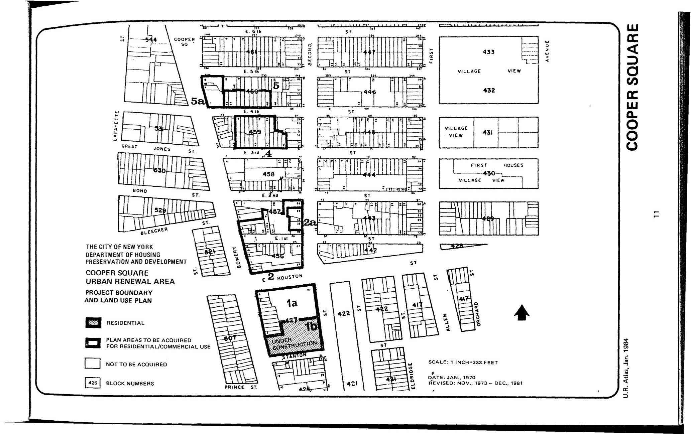

The Cooper Square plan was adopted in 1970, last revised in 2001, and expired in 2010. The plan calls for residential and commercial uses and preserves the Liz Christy garden. It includes these objectives: provide new housing, rehabilitate housing, remove blight, and provide appropriate community facilities, parks, recreational, shopping, parking, and open space.
