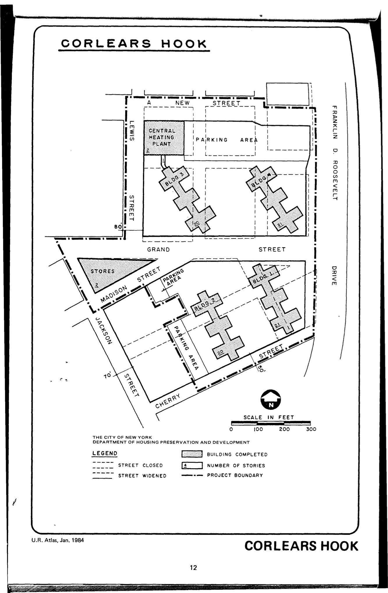

<!---
-->

The Corlears Hook plan was adopted in 1952 and expired in 1992. It calls for residential, commercial, open space, and parking uses on lots in the plan area. HPD has not yet made the most recent revision of this plan available to our team but you can see the original: Committee on Slum Clearance Plans (1951), [_Corlears Hook: Slum Clearance Plan Under Title 1 of the Housing Act of 1949_](https://archive.org/details/corlearshookslum00newy), adopted 1952.

We mapped this plan based on secondary sources created by NYC Government offices. See [References](http://www.urbanreviewer.org/#page=references.html).