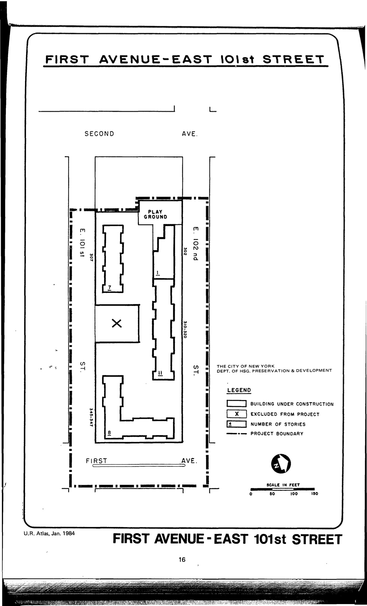

<!---
-->

The First Avenue–East 101st Street plan was adopted in 1965 and expired in 2005. It designates residential, recreational, community facility, and parking uses for the plan area.

See [References](http://www.urbanreviewer.org/#page=references.html).
