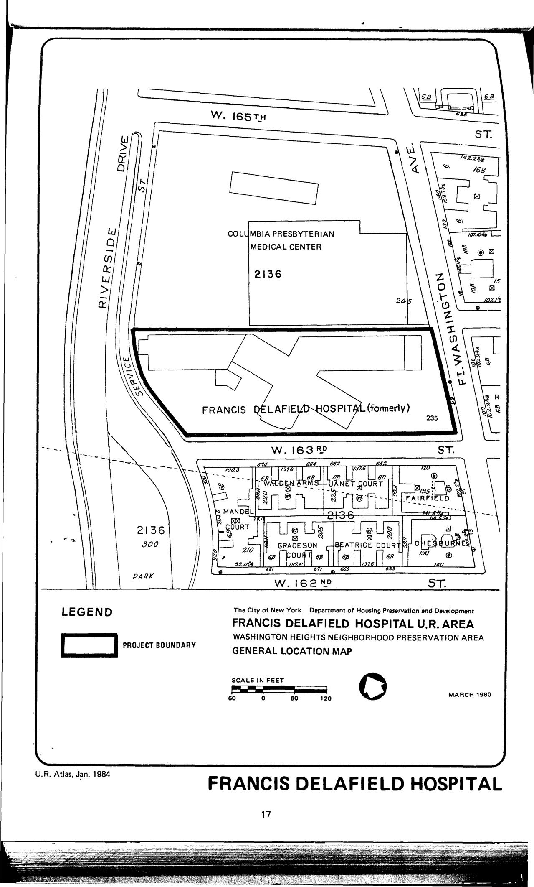

The Francis Delafield Hospital plan was adopted in 1981 and will expire in 2021. It entails "the rehabilitation of a former hospital to eliminate blight and create 231 residential units for elderly and handicapped persons of low income . . . and may include community facilities within the building that benefit the types of residents that it seeks to house."

See [References](http://www.urbanreviewer.org/#page=references.html). 