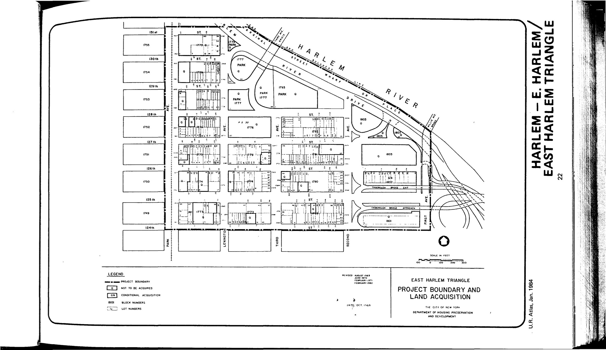

.jpg)

The Harlem–East Harlem plan was adopted in 1968, last revised in 2008, and expires in 2020. It outlines residential, commercial, institutional (including schools, libraries, community centers, hospitals, and other essential service uses), and industrial uses for lots in the plan area.
