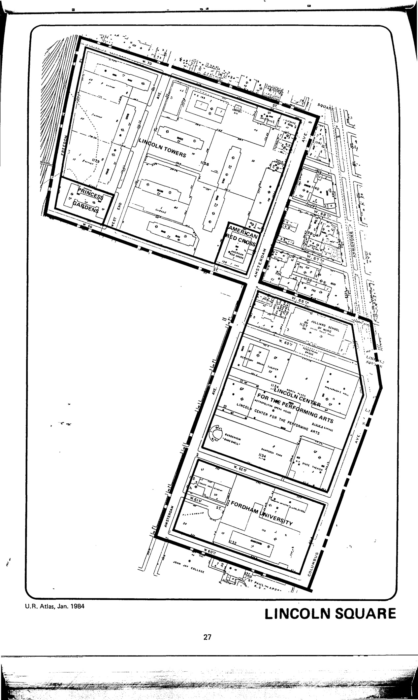

<!---

-->

The Lincoln Square plan was adopted in 1957, last revised in 1988, and expired in 1997. It provides for the development of Lincoln Center (a performing arts center) and includes a range of other uses: residential, retail, commercial, public park, school, playground, and institutional (both collegiate and Red Cross).

See [References](http://www.urbanreviewer.org/#page=references.html).

Here's a flavor of what was here before this plan was adopted and realized:

[A West Side Neighborhood Before Lincoln Center](https://ephemeralnewyork.wordpress.com/2014/02/03/a-west-side-neighborhood-before-lincoln-center/)

[San Juan Hill](https://ephemeralnewyork.wordpress.com/2008/10/15/manhattans-long-gone-san-juan-hill/)
