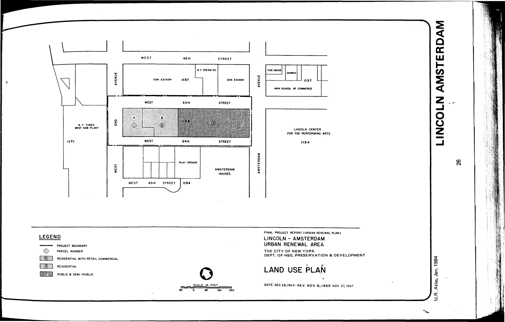

<!----->

The Lincoln–Amsterdam plan was adopted in 1965, last revised in 1967, and expired in 2004. It designates low-income residential, moderate-income residential with retail commercial, public, and semi-public uses for the plan area.

[NYC Housing Preservation and Development, Lincoln-Amsterdam Urban Renewal Area Plan, Minor Change (1968)](https://www.nyc.gov/assets/hpd/downloads/pdfs/services/lincoln-amsterdam-urp-first-minor-change.pdf).
