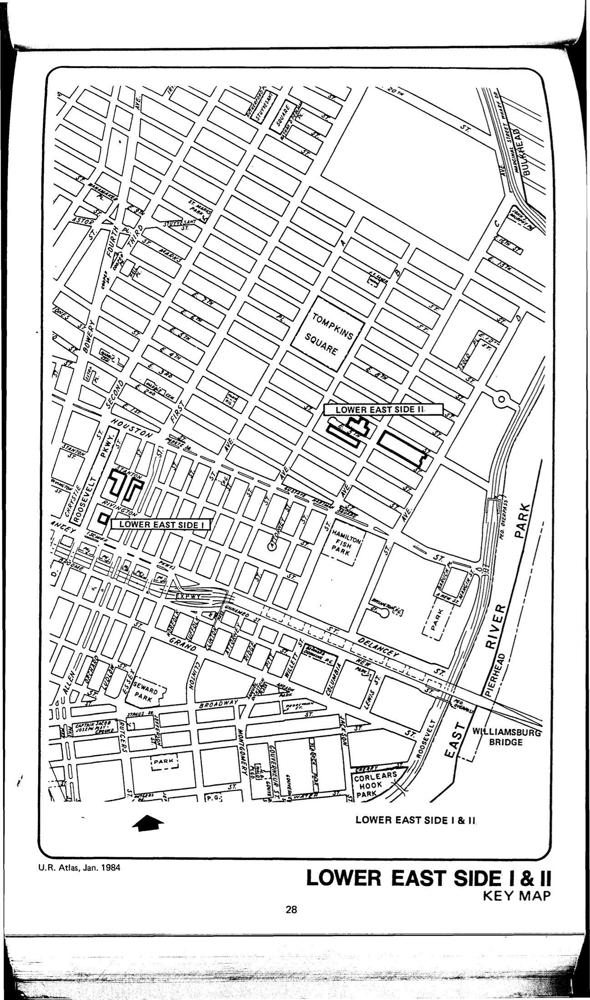
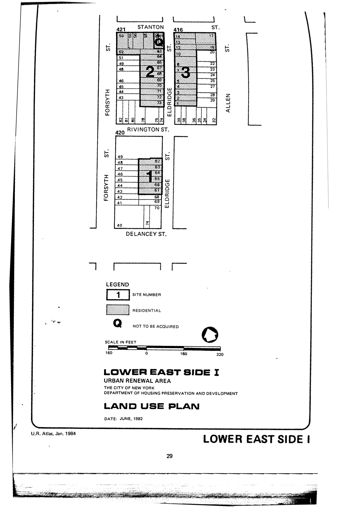

The Lower East Side I plan was adopted in 1983, last revised in 1984, and will expire in 2023. Its stated objective "as a step toward supporting and rebuilding a physically eroding but vital community" is to construct "new housing on sites occupied by deteriorating housing stock and vacant buildings and lots."

See [References](http://www.urbanreviewer.org/#page=references.html). 