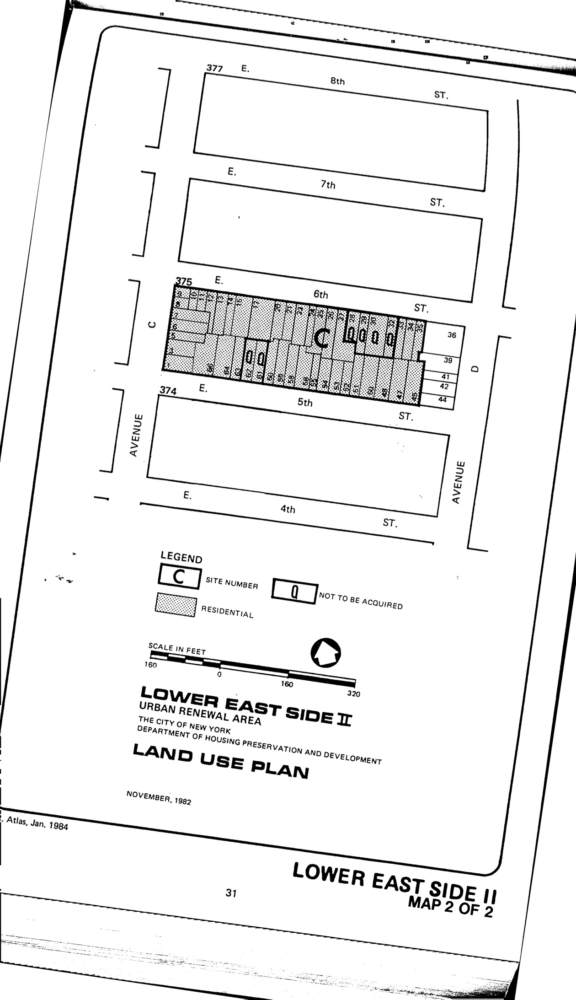

The Lower East Side II plan was adopted in 1984 and expired in 2004. Its stated objective "as a step toward supporting and rebuilding a physically eroding but vital community" is to construct "new housing on sites occupied by deteriorating housing stock and vacant buildings and lots."

[NYC Housing Preservation and Development, Lower East Side II Urban Renewal Area Plan (1984).](https://www.nyc.gov/assets/hpd/downloads/pdfs/services/lower-east-side-ii-urp.pdf)
