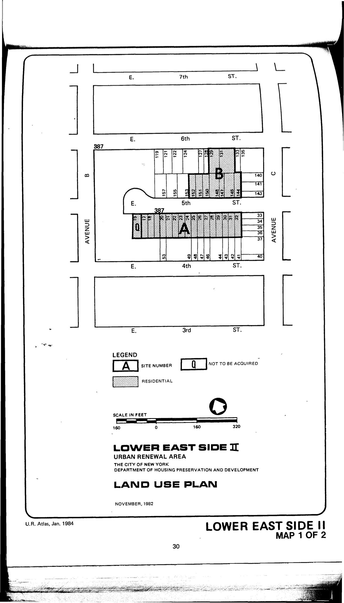

The Lower East Side II plan was adopted in 1984 and expired in 2004. Its stated objective "as a step toward supporting and rebuilding a physically eroding but vital community" is to construct "new housing on sites occupied by deteriorating housing stock and vacant buildings and lots."

See [References](http://www.urbanreviewer.org/#page=references.html). 