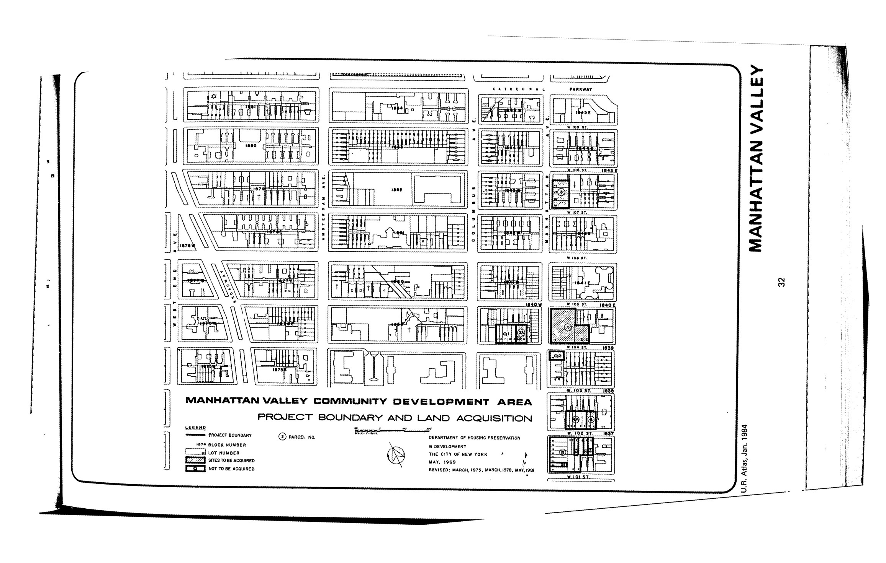

The Manhattan Valley plan was adopted in 1969, last revised in 1981, and expired in 2009. It designates residential and accessory community facility and/or commercial uses for lots in the plan area.

[NYC Housing Preservation and Development, Manhattan Valley First Amended Urban Renewal Area Plan, Minor Change (1978).](https://www.nyc.gov/assets/hpd/downloads/pdfs/services/manhattan-valley-first-amended-urp-first-minor-change.pdf)
