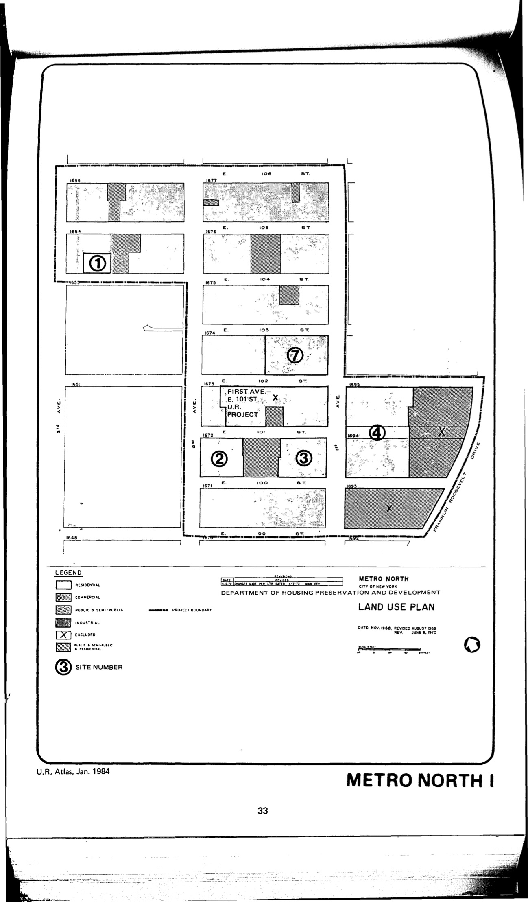

The Metro North plan was adopted in 1968, last revised in 1988, and expired in 2008. It designates lots in the plan area for residential use.

See [References](http://www.urbanreviewer.org/#page=references.html). 