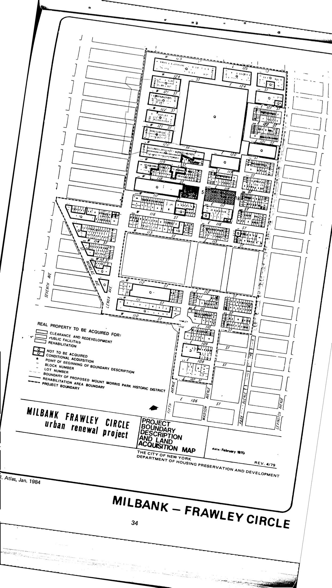

The Milbank Frawley Circle–East plan was adopted in 1994, last revised in 2003, and expires in 2034. It is a spin-off of the Milbank Frawley Circle urban renewal area. It delineates residential, commercial, public, and semi-public uses for lots in the plan area.

You can read some of the 1965 NYC Department of City Planning Study that led to the eventual adoption of the plan [here](https://drive.google.com/drive/folders/0B0R59QsmZxIydlFkVGVmQU9yVmc). This scan was made in 2016 at the National Archives in Washington DC by Charles Chawalko. 

The 1967 City Planning Commission report on the occasion of the plan's approval is [here](https://drive.google.com/open?id=0B9k_zNeDs7q-SHVWNl8zR1R2ZHc). The Third Amended Plan (1970) is [here](https://drive.google.com/open?id=0B9k_zNeDs7q-dWIxNFhrWG9oZE0) (both retrieved from the Department of City Planning Archives via the Freedom of Information Law).

[NYC Housing Preservation and Development, Milbank Frawley Circle-East Second Amended Urban Renewal Area Plan (2017).](https://www.nyc.gov/assets/hpd/downloads/pdfs/services/milbank-frawley-circle-east-second-amended-urp.pdf)
