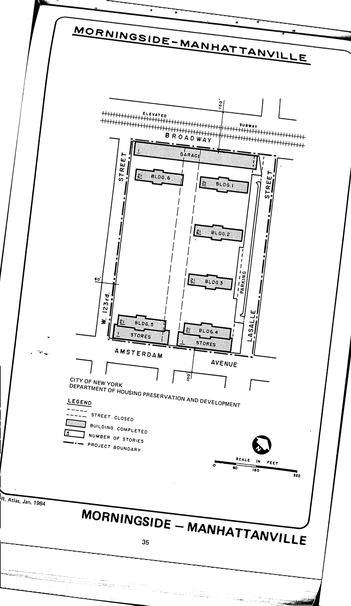

<!----->

The Morningside-Manhattanville plan was adopted in approximately 1956 and expired in approximately 1996. It calls for cooperative residential, commercial retail, and parking uses in the plan area. HPD has not yet made the plan available to our team.

NYC Housing Preservaton and Development has not made the plan availalble [on its website.](https://www.nyc.gov/site/hpd/services-and-information/urban-renewal-details.page?areaId=30)
