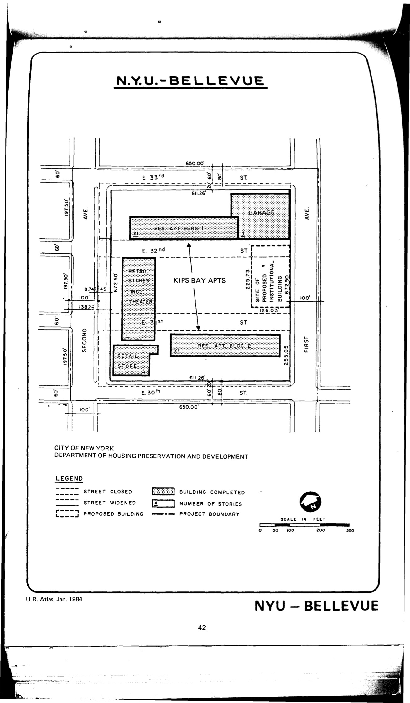

The New York University–Bellevue plan was adopted in 1954, last revised in 1984, and expired in 1994. It outlines primarily residential use with a small retail section in the plan area.

See [References](http://www.urbanreviewer.org/#page=references.html). 