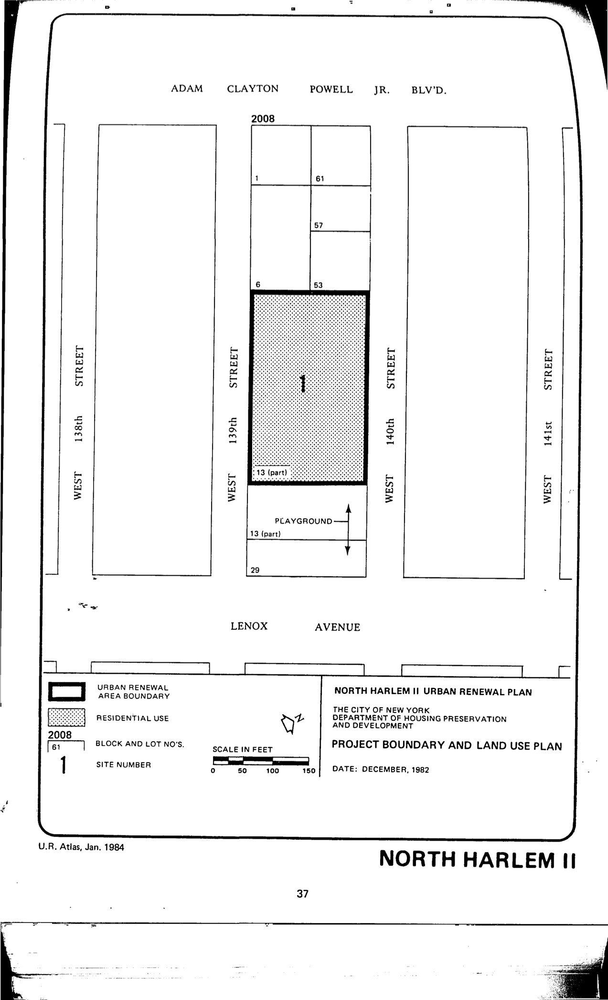

The North Harlem II plan was adopted in 1983, last revised in 1984, and expires in 2023. It delineates institutional and residential uses for lots in the plan area.

See [References](http://www.urbanreviewer.org/#page=references.html). 
