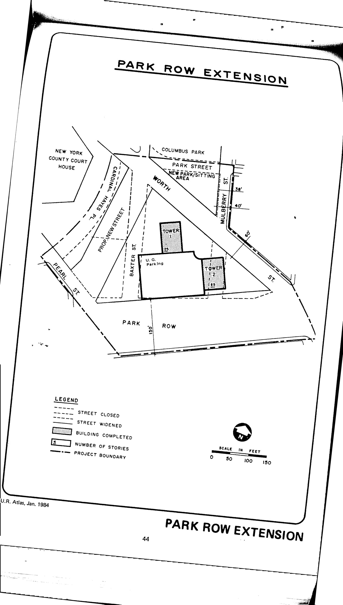

The Park Row Extension plan was adopted in 1961, last revised in 1964, and expired in 2001. It calls for clearance and redevelopment of the plan area for predominantly residential use and entails some street remapping. The plan includes multi-family residential, public and semi-public park, and court-house parking.

See [References](http://www.urbanreviewer.org/#page=references.html). 