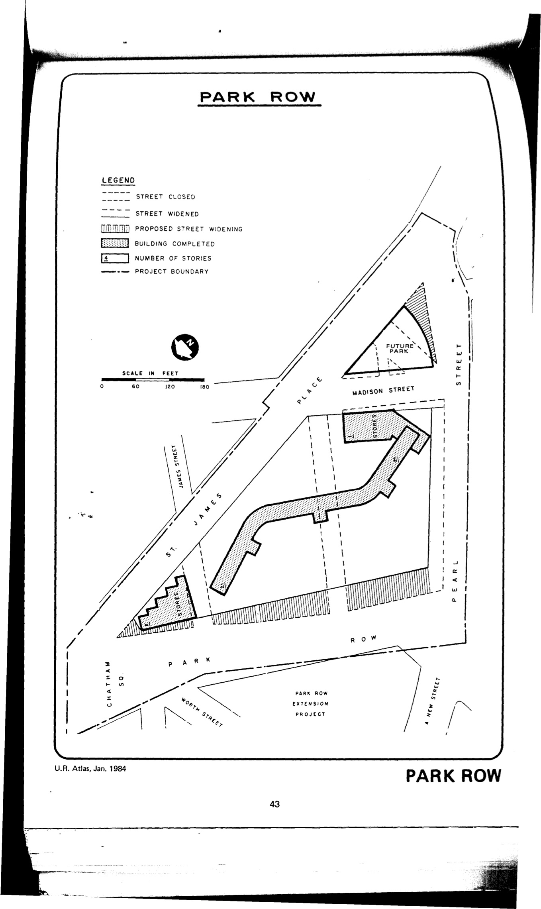

<!---
-->

The Park Row plan was adopted in 1958 and expired in 1998. It calls for residential and commercial uses on the lots in the plan area. HPD has not yet made the plan available to our team.

[NYC Housing Preservation and Development, Park Row First Amended Urban Renewal Area Plan (1964).](https://www.nyc.gov/assets/hpd/downloads/pdfs/services/park-row-first-amended-urp.pdf)
