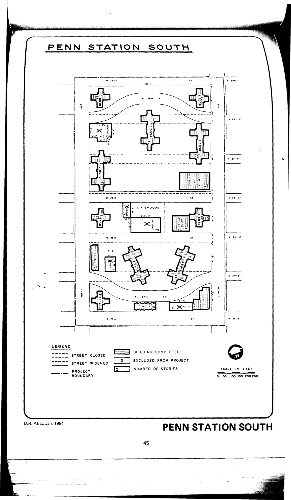

<!----->

The Penn Station South plan was adopted in approximately 1955 and expired in approximately 1995. It calls for residential, retail, community facility, playground, open space, and parking uses in the plan area. We could not access the plan documents when we originally made this website; mapped this plan based on the following document: Committee on Slum Clearance (1957), _Penn Station South: Slum Clearance Plan Under Title 1 of the Housing Act of 1949 As Amended_. Since then, NYC HPD has posted the document:

[NYC Housing Preservation and Development, Penn Station South Urban Renewal Area Plan (1959).](https://www.nyc.gov/assets/hpd/downloads/pdfs/services/penn-station-south-urp.pdf)
