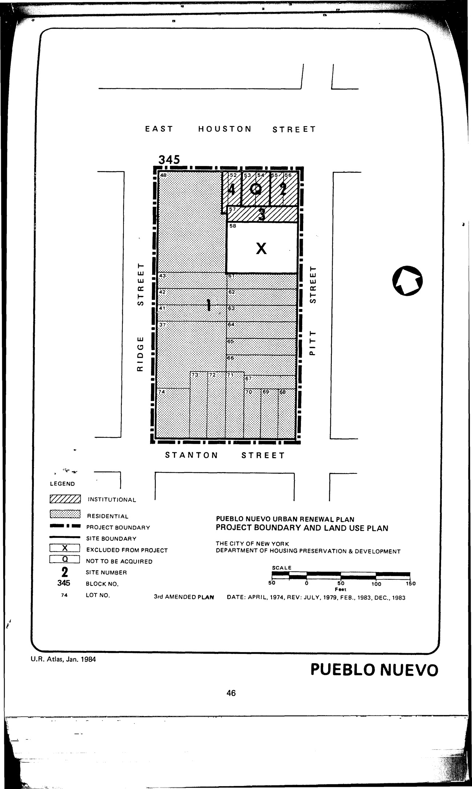

The Pueblo Nuevo plan was adopted in 1975, last revised in 1983, and expires in 2015. It assigns residential and institutional uses for the lots in the plan area.

See [References](http://www.urbanreviewer.org/#page=references.html). 
