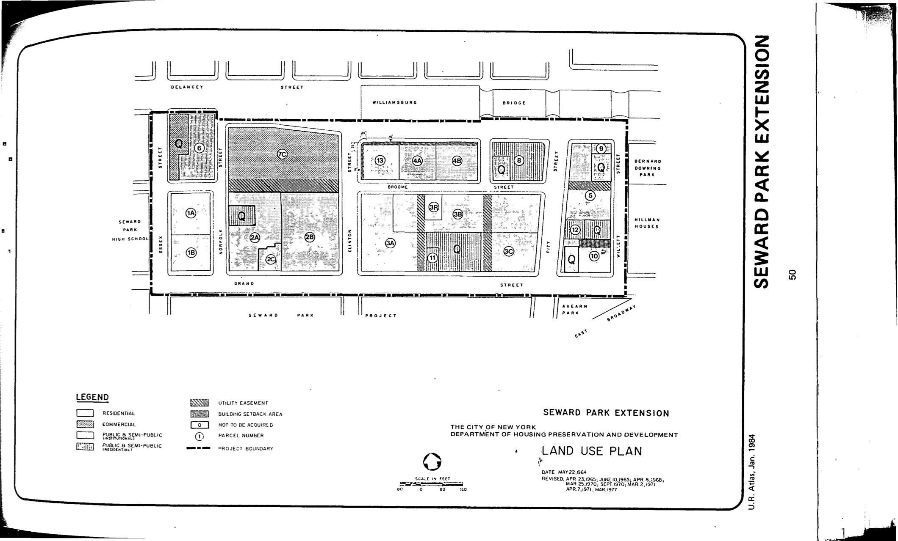

<!---
-->

The Seward Park Extension plan was approved in 1965, last revised in 1983, and expired in 2005. It delineates residential, commercial, and public and semi-public uses for the lots in the plan area.

See [References](http://www.urbanreviewer.org/#page=references.html).