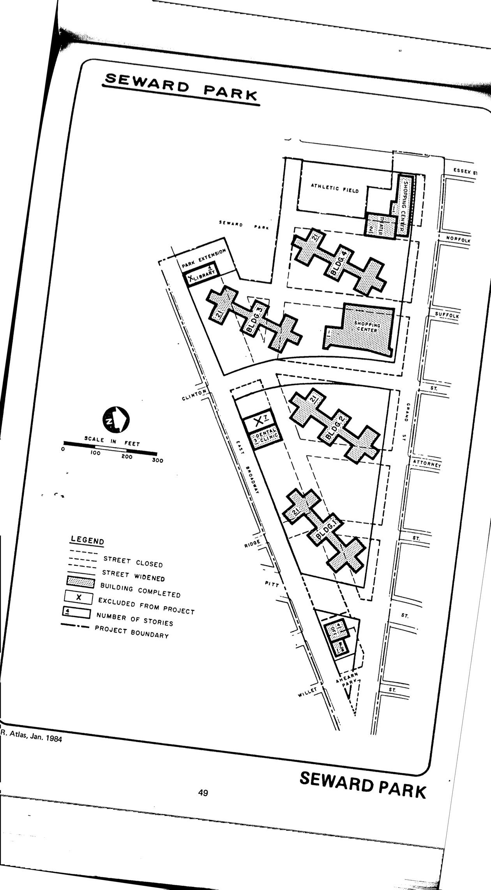

The Seward Park plan was adopted in approximately 1952 and expired in approximately 1992. HPD has not yet made the plan available to our team.

See [References](http://www.urbanreviewer.org/#page=references.html). 