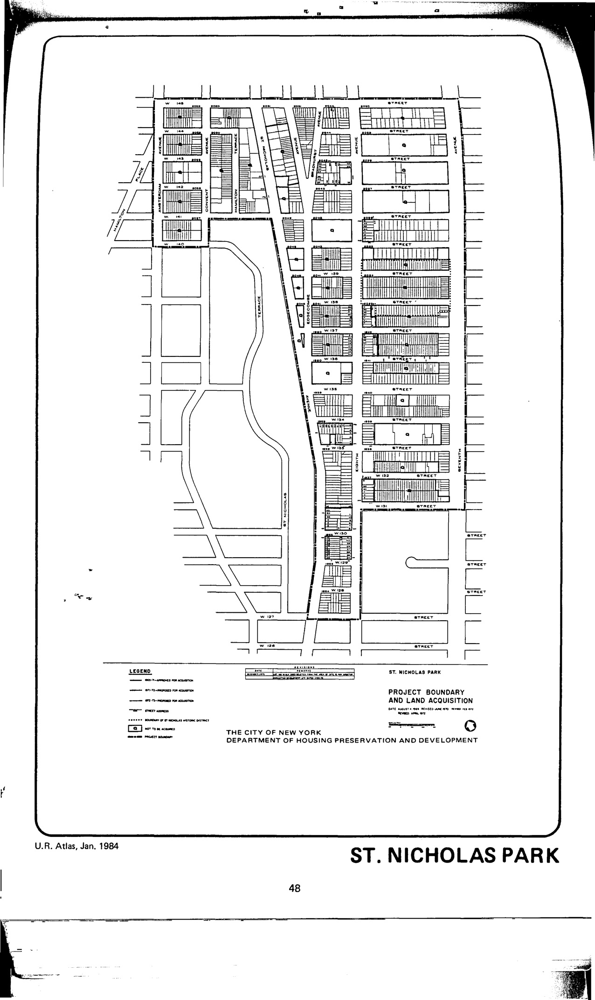

<!---

-->

The St. Nicholas Park plan was adopted in 1968, last revised in 1997, and expired in 2008. It calls for commercial use and utility and emergency-vehicle easements in the plan area.

[NYC Housing Preservation and Development, Seward Park Extension Eighth Amended Urban Renewal Area Plan (1997).](https://www.nyc.gov/assets/hpd/downloads/pdfs/services/st-nicholas-park-eighth-amended-urp.pdf)
