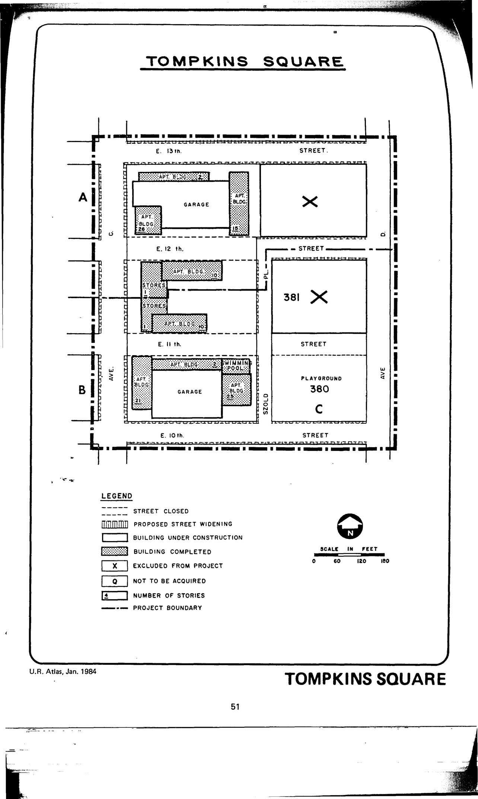

The Tompkins Square plan was adopted in 1960, last revised in 1962, and expired in 2000. It calls for clearance and redevelopment for residential, retail commercial, public and semi-public use, and street widenings in the plan area.

See [References](http://www.urbanreviewer.org/#page=references.html). 
