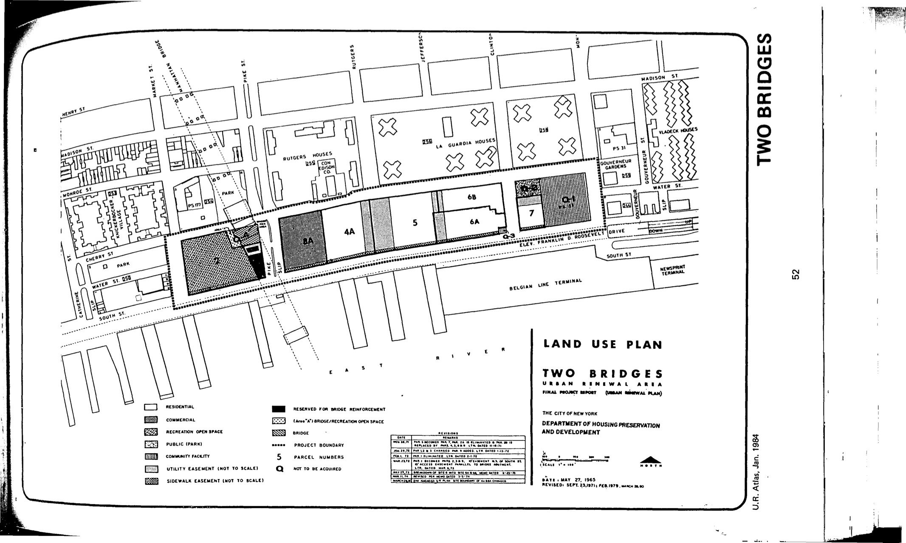

<!---
-->

The Two Bridges plan was adopted in 1967, last revised in 1995, and expired in 2007. It assigns residential, commercial, public use/commercial, and recreational open space uses for the lots in the plan area.

[NYC Housing Preservation and Development, Two Bridges Fourth Amended Urban Renewal Area Plan (1995).]
(https://www.nyc.gov/assets/hpd/downloads/pdfs/services/two-bridges-fourth-amended-urp.pdf)
