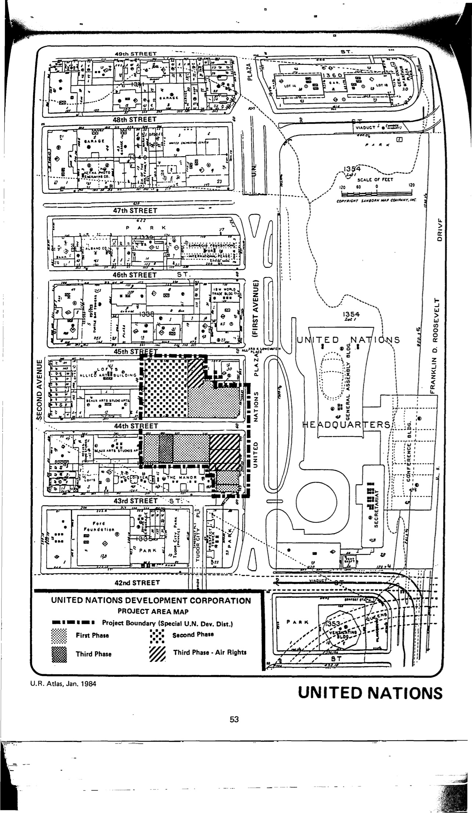

The United Nations plan was not a true urban renewal project, but it was included in HPD's 1984 _Atlas of Urban Renewal Project Areas in the City of New York_. According to Samuel Zipp's 2012 book _Manhattan Projects: The Rise and Fall of Urban Renewal in Cold War New York_, John D. Rockefeller gave the land to the United Nations and Robert Moses arranged for permits and rights-of-way, but no federal or state funding was used for the construction of the UN headquarters (17-18). 