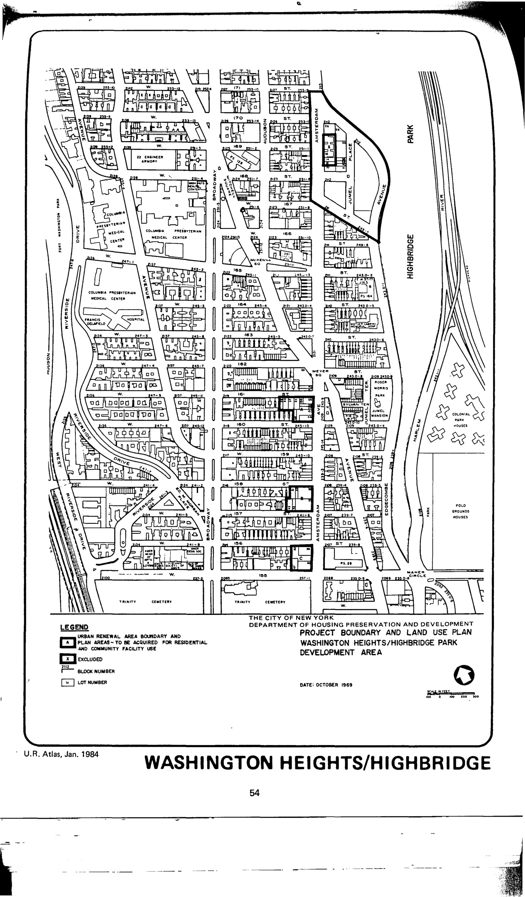

The Washington Heights/Highbridge Park plan was adopted in 1970, last revised in 1993, and expired in 2010. It proposes residential development with appurtenant recreational, open space, and community facilities as well as parking and local commercial uses for lots in the plan area. Designated community facilities and institutional uses include schools and a police precinct.

[NYC Housing Preservation and Development, Washington Heights-Highbridge Park First Amended Urban Renewal Area Plan (1994).](https://www.nyc.gov/assets/hpd/downloads/pdfs/services/washington-heights-highbridge-park-first-amended-urp.pdf)
