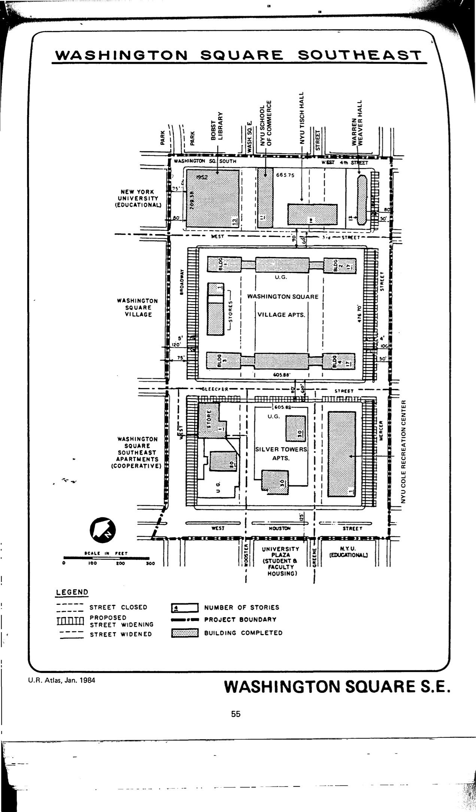

<!---->

The Washington Square Southeast plan was adopted in 1954, last revised in 1978, and expired in 1994. It designates educational, residential, and retail uses for the plan area.

See [References](http://www.urbanreviewer.org/#page=references.html).