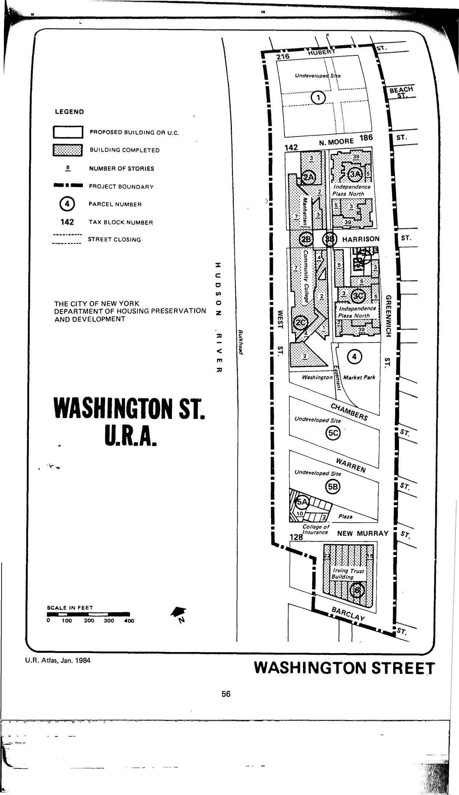

<!---
-->

The Washington Street plan was adopted in 1962, last revised in 1992, and expired in 2002. Proposed uses for the plan area include 2 million square feet of commercial/retail space, 1.5 million square feet of residential space, 1 million square feet for institutional uses, and public access to 24-hour shopping plazas or other open space.

Some reference materials:

Diane Alyssa Jackier, [Moving Historic Structures: The Washington Street Urban Renewal Project](https://repository.upenn.edu/cgi/viewcontent.cgi?article=1446&context=hp_theses), Penn School of Design Thesis (2001).

The Columbia University Libraries have Herbert B. Oppenheimer's architectural drawings for the project, 1960s-1980s, in its collection. You can find information [here](http://www.columbia.edu/cu/lweb/archival/collections/ldpd_10979295/).

[NYC Housing Preservation and Development, Washington Square Ninth Amended Urban Renewal Area Plan, First Minor Change (1993).](https://www.nyc.gov/assets/hpd/downloads/pdfs/services/washington-street-ninth-amended-urp-first-minor-change.pdf)
