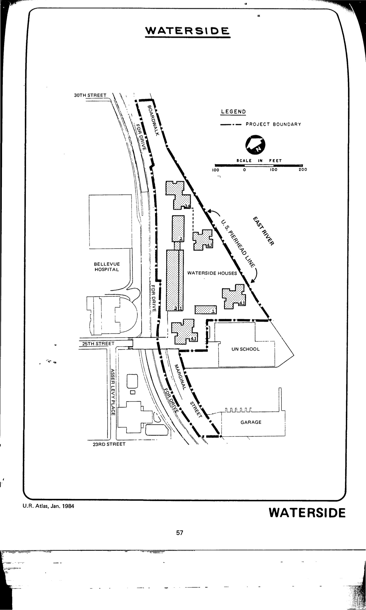

The Waterside plan was adopted in 1967 and will expire in 2066. It proposes new residential development with appurtenant accessory uses including parks and open space in the plan area.

See [References](http://www.urbanreviewer.org/#page=references.html). 