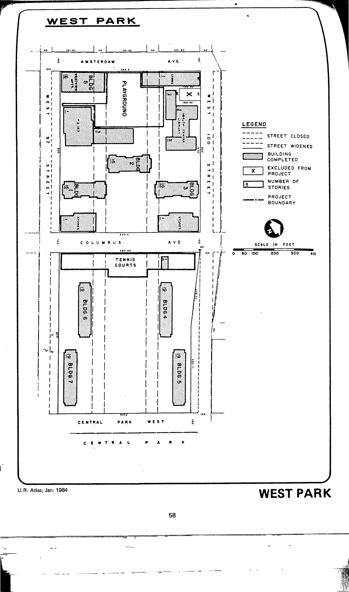

The West Park plan was adopted in 1952 and expired in 1992. It calls for moderate-income residential space with provisions for recreational, institutional, and commercial facilities in the plan area. HPD has not yet made the plan available to our team.

See [References](http://www.urbanreviewer.org/#page=references.html). 