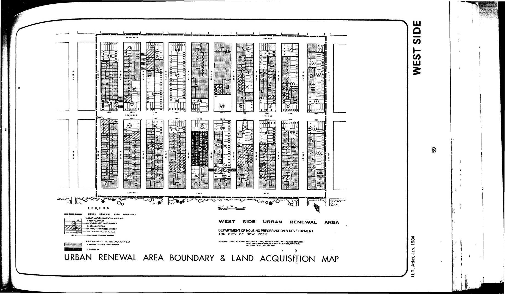

<!---

-->

The West Side plan was adopted in 1962, last revised in 2000, and expired in 2002. It includes a range of low-income, moderate-income, and market-rate housing, public school facilities, public park or playground, public health facility, and commercial uses for lots in the plan area.

Residents of the neighborhood organized to resist the plan and even occupied the buildings after the original residents were evicted to ready them for demolition in a campaign in 1970 called "Operation Move-In." Read about it here: [http://centropr.hunter.cuny.edu/sites/default/files/Journal/2007-2010/Vol_21_2_2009_fall/7_Muzio_pg108-141.pdf](http://centropr.hunter.cuny.edu/sites/default/files/Journal/2007-2010/Vol_21_2_2009_fall/7_Muzio_pg108-141.pdf)

See [References](http://www.urbanreviewer.org/#page=references.html).
