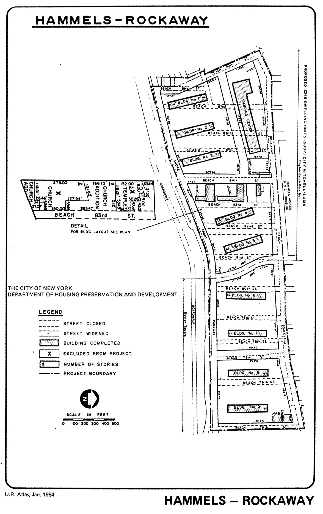

<!---
-->

The Hammels–Rockaway plan was adopted in 1958, last revised in 1990, and expired in 2008. It provides for site clearance and the development of multi-family Mitchell-Lama housing, parking, recreational and community facilities, and shopping uses in the plan area.

See [References](http://www.urbanreviewer.org/#page=references.html).