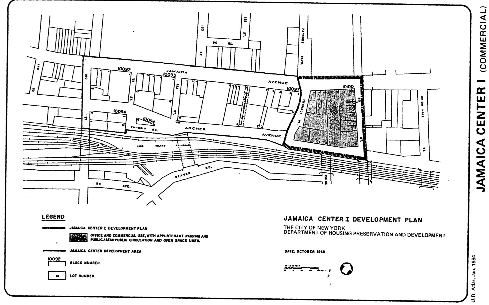

The Jamaica Center I plan was adopted in 1970, last revised in 1998, and expired in 2010. It calls for office and commercial use, with appurtenant parking, public/semi-public circulation, and open space uses on the site.

[NYC Housing Preservation and Development, Jamaica Center I Urban Renewal Plan (1970).](https://www.nyc.gov/assets/hpd/downloads/pdfs/services/jamaica-center-i-urp.pdf)
