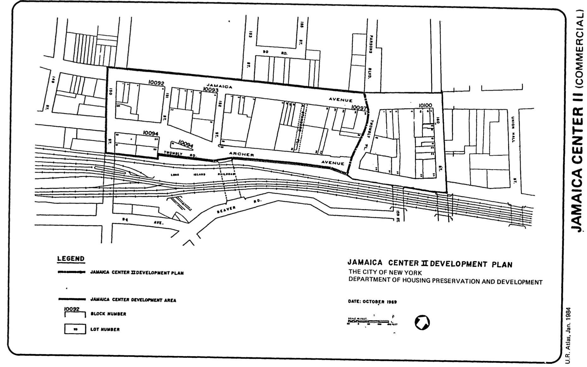

The Jamaica Center II plan was adopted in 1971, last revised in 1997, and expired in 2011. It calls for commercial uses limited to office, retail, and service commercial facilities in the plan area.

[NYC Housing Preservation and Development, Jamaica Center II First Amended Urban Renewal Plan (1998).](https://www.nyc.gov/assets/hpd/downloads/pdfs/services/jamaica-center-ii-first-amended-urp.pdf)
