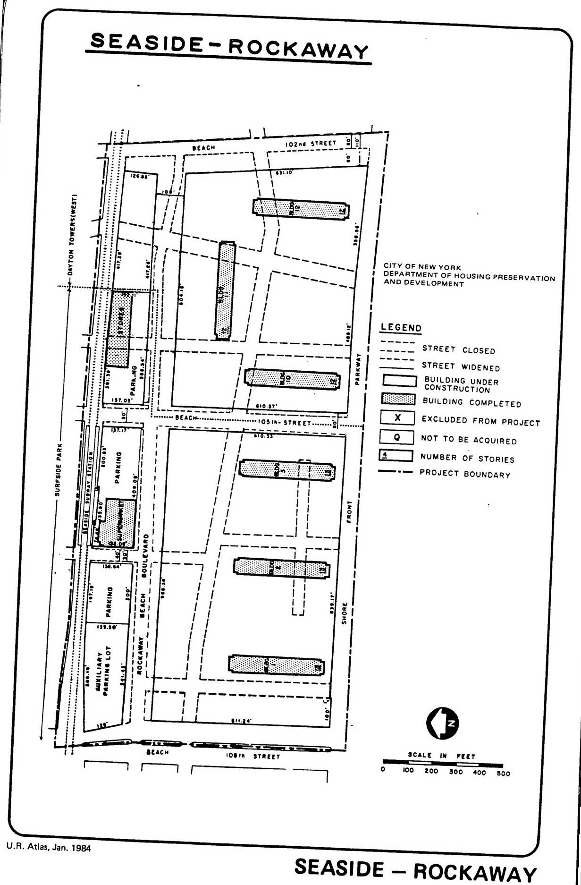

The Seaside-Rockaway plan was adopted in 1958 and expired in 1998. It calls for middle-income residential, recreational, and commercial retail uses in the plan area.

See [References](http://www.urbanreviewer.org/#page=references.html).