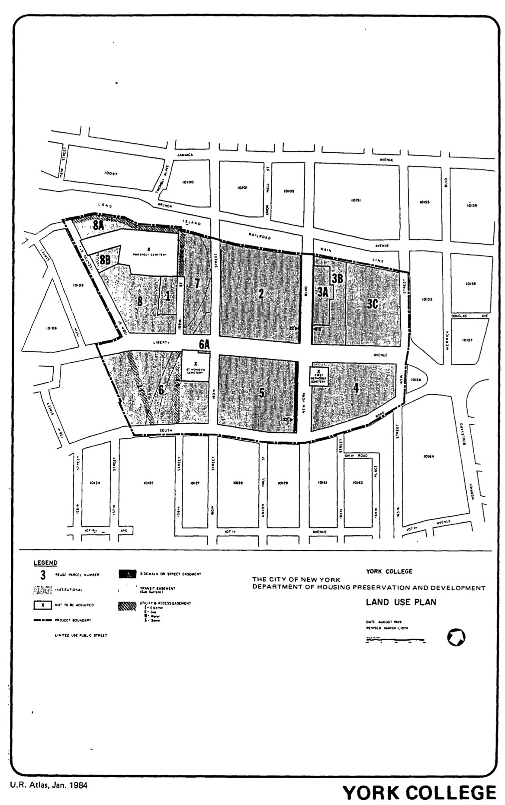

<!----->

The York College plan was adopted in 1968, last revised in 1996, and expired in 2008. It outlines the creation of laboratory and office space for a new Food and Drug Administration location, including campus research buildings for CUNY and/or York College.

[NYC Housing Preservation and Development, York College Second Amended Urban Renewal Area Plan (1996).](https://www.nyc.gov/assets/hpd/downloads/pdfs/services/york-college-second-amended-urp.pdf)
