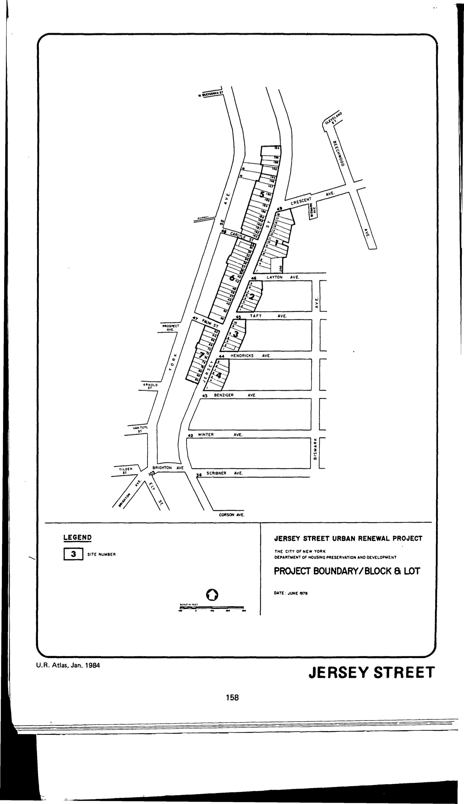

The Jersey Street plan was adopted in 1979, last revised in 1985, and expires in 2019. It designates lots in the plan area for residential use.

See [References](http://www.urbanreviewer.org/#page=references.html).