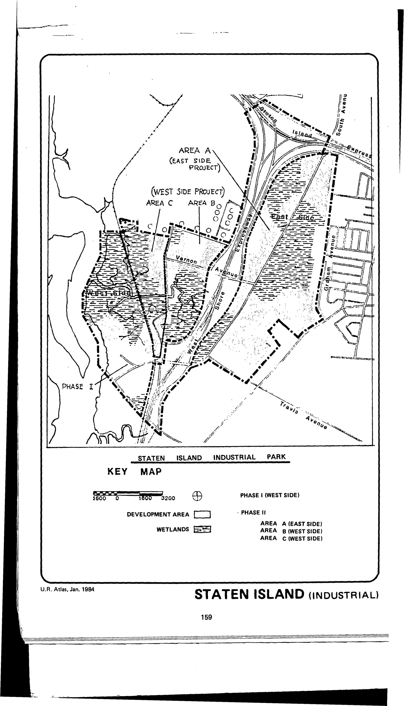

The Staten Island Industrial Park I plan was adopted in 1971 and expired in 2011. It designates lots in the plan area for industrial use.

See [References](http://www.urbanreviewer.org/#page=references.html).